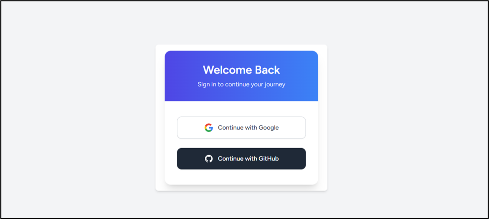
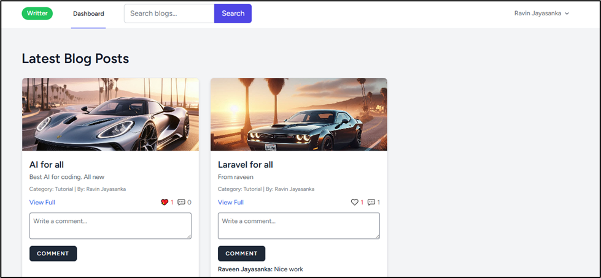
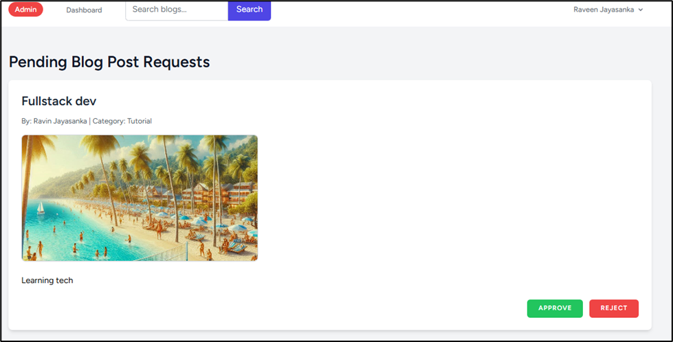
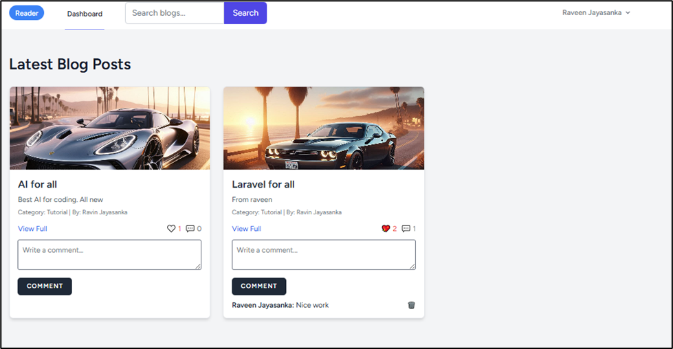

# BlogBites

BlogBites is a modern Laravel-based blogging platform that enables users to read, write, and manage articles. It features a robust writer request system, user authentication, and a clean, responsive UI.

## Video demo link
https://youtu.be/rv2aiEDsYVQ

## Features

- User registration and authentication
- Submit requests to become a writer
- Admin approval workflow for writer requests
- Article creation, editing, and management
- Responsive design with Tailwind CSS
- RESTful API endpoints for core resources

## Screenshots






## Requirements

- PHP >= 8.1
- Composer
- Node.js & npm
- MySQL or compatible database

## Setup Instructions

1. **Clone the repository**
   ```sh
   git clone https://github.com/yourusername/BlogBites.git
   cd BlogBites
   ```

2. **Install PHP dependencies**
   ```sh
   composer install
   ```

3. **Install JavaScript dependencies**
   ```sh
   npm install
   ```

4. **Copy environment file and configure**
   ```sh
   cp .env.example .env
   ```
   Edit `.env` and set your database credentials and other environment variables.

5. **Generate application key**
   ```sh
   php artisan key:generate
   ```

6. **Run migrations**
   ```sh
   php artisan migrate
   ```

7. **Build frontend assets**
   ```sh
   npm run build
   ```

8. **Start the development server**
   ```sh
   php artisan serve
   ```

## API Documentation

## Authentication & Social Login

### Social Login Redirect
- **GET** `/socialite/{driver}`
- **Description:** Redirects user to the OAuth provider (GitHub or Google).
- **Parameters:** `driver` (`github` or `google`)
- **Auth:** None

### Social Login Callback
- **GET** `/auth/{driver}/login`
- **Description:** Handles the OAuth callback from the provider.
- **Parameters:** `driver` (`github` or `google`)
- **Auth:** None

### Logout
- **POST** `/logout`
- **Description:** Logs out the authenticated user.
- **Auth:** Required

---

## User & Profile

### Dashboard
- **GET** `/dashboard`
- **Description:** Returns the dashboard view for the authenticated user.
- **Auth:** Required

### Profile
- **GET** `/profile`
- **Description:** Returns the profile page for the authenticated user.
- **Auth:** Required

---

## Blog Management

### Create Blog (Form)
- **GET** `/create-blog`
- **Description:** Returns the blog creation form.
- **Auth:** Required, Role: `admin` or `writter`

### Create Blog (Store)
- **POST** `/create-blog`
- **Description:** Stores a new blog post.
- **Body:** `title`, `content`, etc.
- **Auth:** Required, Role: `admin` or `writter`

### View Blog by Slug
- **GET** `/blog/{slug}`
- **Description:** View a blog post by its slug.
- **Parameters:** `slug`

### View Single Blog
- **GET** `/blogSingle/{slug}`
- **Description:** View a single blog post in detail.
- **Parameters:** `slug`

### Edit Blog
- **GET** `/blog/{blogID}/edit`
- **Description:** Returns the edit form for a blog post.
- **Parameters:** `blogID`
- **Auth:** Required

### Update Blog
- **PUT** `/blog/{blogID}`
- **Description:** Updates a blog post.
- **Parameters:** `blogID`
- **Body:** `title`, `content`, etc.
- **Auth:** Required

### Delete Blog
- **DELETE** `/blog/{blogID}`
- **Description:** Deletes a blog post.
- **Parameters:** `blogID`
- **Auth:** Required

---

## Blog Interactions

### Comment on Blog
- **POST** `/blog/{id}/comment`
- **Description:** Adds a comment to a blog post.
- **Parameters:** `id` (blog ID)
- **Body:** `comment`
- **Auth:** Required

### Delete Comment
- **DELETE** `/blog/comment/{commentID}`
- **Description:** Deletes a comment.
- **Parameters:** `commentID`
- **Auth:** Required

### Like Blog (Profile)
- **POST** `/blog/{id}/like`
- **Description:** Likes a blog post from the profile.
- **Parameters:** `id` (blog ID)
- **Auth:** Required

### Like Blog (Dashboard)
- **POST** `/blog/{id}/Dashboardlike`
- **Description:** Likes a blog post from the dashboard.
- **Parameters:** `id` (blog ID)
- **Auth:** Required

### Save/Unsave Blog
- **POST** `/blog/{id}/save`
- **Description:** Toggles save/unsave for a blog post.
- **Parameters:** `id` (blog ID)
- **Auth:** Required

---

## Saved Posts

### View Saved Posts
- **GET** `/saved-posts`
- **Description:** Lists all saved blog posts for the user.
- **Auth:** Required

### Remove Saved Post
- **DELETE** `/saved-posts/{blogID}`
- **Description:** Removes a blog post from saved posts.
- **Parameters:** `blogID`
- **Auth:** Required

---

## Writer Requests

### View Writer Request Form
- **GET** `/become-writer`
- **Description:** Shows the form to request writer access.
- **Auth:** Required

### Submit Writer Request
- **POST** `/become-writer`
- **Description:** Submits a request to become a writer.
- **Auth:** Required

---

## Admin Endpoints

> All admin endpoints require authentication and `admin` role.

### Post Requests (Audit)
- **GET** `/admin/post-requests`
- **Description:** Lists blog posts pending admin approval.

- **POST** `/admin/post-requests/{blogID}/approve`
- **Description:** Approves a blog post.
- **Parameters:** `blogID`

- **POST** `/admin/post-requests/{blogID}/reject`
- **Description:** Rejects a blog post.
- **Parameters:** `blogID`

### Manage Users
- **GET** `/admin/manage-users`
- **Description:** Lists all users.

- **PUT** `/admin/manage-users/{userID}`
- **Description:** Updates a user's role.
- **Parameters:** `userID`
- **Body:** `role`

### Manage Writer Requests
- **GET** `/admin/writer-requests`
- **Description:** Lists all writer requests.

- **POST** `/admin/writer-requests/{id}/approve`
- **Description:** Approves a writer request.
- **Parameters:** `id`

- **POST** `/admin/writer-requests/{id}/reject`
- **Description:** Rejects a writer request.
- **Parameters:** `id`

### Manage Blog Posts
- **GET** `/admin/manage-posts`
- **Description:** Lists all blog posts.

- **GET** `/admin/manage-posts/{blogID}/edit`
- **Description:** Returns the edit form for a blog post.
- **Parameters:** `blogID`

- **PUT** `/admin/manage-posts/{blogID}`
- **Description:** Updates a blog post.
- **Parameters:** `blogID`

- **DELETE** `/admin/manage-posts/{blogID}`
- **Description:** Deletes a blog post.
- **Parameters:** `blogID`

- **POST** `/admin/manage-posts/{blogID}/toggle-status`
- **Description:** Toggles the published status of a blog post.
- **Parameters:** `blogID`

---

## Search

### Search Blogs
- **GET** `/blogs/search`
- **Description:** Searches blogs by query parameters.

### View Blog by ID
- **GET** `/blogs/{blogID}`
- **Description:** View a blog post by its ID.
- **Parameters:** `blogID`

---


## Contributing

Contributions are welcome! Please submit pull requests and issues via GitHub.

## License

This project is open-sourced under the [MIT license](https://opensource.org/licenses/MIT).
